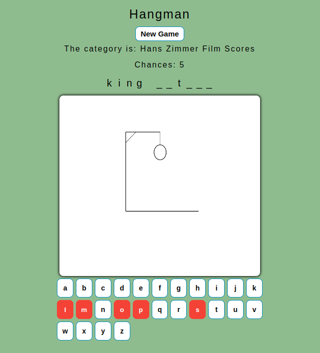

# Hangman

## Description

Hangman is a game where a player is given a blank set of spaces,
representative to the length of an unknown word. Players are then
given a topic as to what that word could be, and are given a set
amount of guesses they can make before losing the game. The goal is
to correctly guess the unknown word before their number of attempts
run out

The purpose of this application was to gain more practice building a React app completely from scratch, and to have a better understanding of Webpack. I also wanted to design a classic game without any outside help; no tutorials were followed. This challenged my critical thinking, problem-solving, and debugging skills. I truly had a fun experience building this application, and now I get to have a fun time playing it! I hope you test it out for yourself and have a fun time as well.

## Technologies

- React v18
- Webpack
- Babel
- Hosted via GitHub pages
- Hangman Art: designed by yours truly on my laptop

## Installation

No installation is needed
